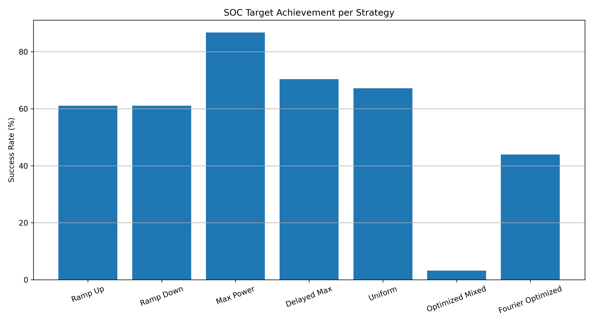
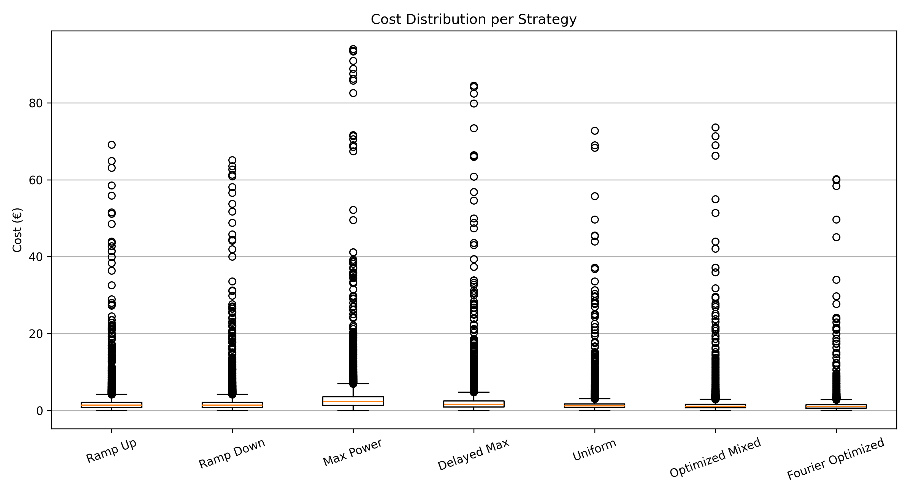
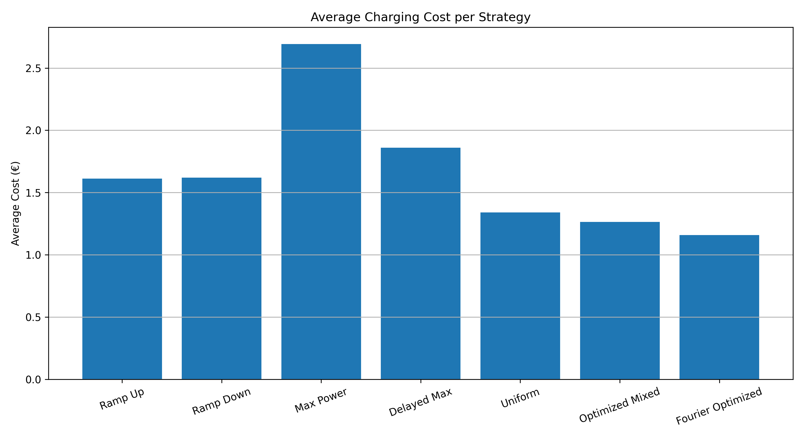

# EV Charging Cost Optimization System

## Overview
This project models and optimizes electric vehicle (EV) charging behavior using real electricity market price data.

It simulates charging sessions and evaluates multiple strategies to minimize cost while ensuring required battery levels (state of charge) are achieved.

---

## Problem
Electricity prices fluctuate significantly over time, making naive charging strategies inefficient and costly.

Key constraints:
- Charging must meet required energy demand (SOC target)
- Power is limited by infrastructure (e.g., 11 kW chargers)
- Time windows for charging are finite

---

## Solution
The system combines simulation and optimization to determine cost-efficient charging behavior.

It:
- Simulates realistic charging sessions with varying durations and SOC levels
- Applies multiple predefined charging strategies
- Implements a dynamic cost-minimizing optimization approach
- Enhances results using Fourier-based smoothing and price-aware adjustments

---

## Features

### Charging Strategies
- Max Power
- Ramp Up / Ramp Down
- Delayed Charging
- Uniform Charging

### Optimization
- Dynamic cost-based decision making
- Constraint-aware scheduling (energy + time limits)
- Fourier-based power profile refinement

### Simulation
- Randomized charging sessions
- Variable SOC requirements
- Strategy benchmarking across thousands of events

---

## Outputs

The system generates:

- Average cost per strategy
- Cost distribution comparisons
- SOC success rates
- Summary results in CSV format

Outputs are saved in:

outputs/figures/  
outputs/results/

## Results & Visualizations

### SOC Target Achievement per Strategy

This plot shows how reliably each strategy meets the required SOC target.

---

### Cost Distribution per Strategy

This visualization highlights variability and outliers in charging costs across strategies.

---

### Average Charging Cost per Strategy

This compares the overall cost efficiency of each strategy.
---

## Conclusion

This study highlights the trade-off between cost efficiency and reliability in EV charging strategies.

- High-power strategies (e.g., Max Power) consistently achieve SOC targets but incur significantly higher costs  
- Simpler strategies (Ramp, Uniform, Delayed) provide balanced performance  
- Optimization-based approaches reduce cost but may fail to consistently meet energy requirements  

In particular:

- The **Optimized Mixed strategy**, which selects the cheapest option per time slot, performs poorly in achieving SOC targets  
  → This indicates that **greedy local optimization is insufficient under global constraints**

- The **Fourier Optimized strategy** achieves the **lowest average cost**, while maintaining smoother charging profiles  
  → However, it still struggles to reliably meet SOC targets in all cases  

---

## Hybrid Strategy Insight (Future Direction)

A key takeaway is that **no single strategy is optimal across all conditions**.

A promising direction is the development of **hybrid charging strategies**, combining:

- Reliability of deterministic strategies (e.g., Max Power, Uniform)
- Cost-awareness of optimized methods
- Smoothness and stability of Fourier-based profiles

For example:

- Use **Max Power or Uniform charging** when approaching SOC deadlines  
- Apply **price-aware optimization** during flexible time windows  
- Use **Fourier smoothing** to refine power profiles and avoid abrupt changes  

Such a hybrid approach could:
- maintain high SOC success rates  
- significantly reduce charging cost  
- improve hardware longevity (by avoiding sharp power spikes)  

---

## Important Note

The hybrid approach described above was **not explicitly implemented in this project**,  
but emerges naturally from the observed limitations of individual strategies.

It represents a logical next step toward real-world EV charging optimization systems.
